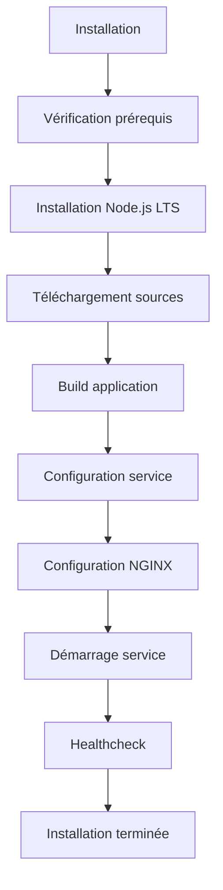

# Architecture du package YunoHost AFFiNE

## 1. Arborescence stricte du package

```
affine_ynh/
├── manifest.toml                    # Manifeste v2 YunoHost
├── conf/
│   ├── nginx.conf                   # Configuration NGINX
│   └── systemd/
│       └── affine.service           # Service systemd
├── scripts/
│   ├── install                      # Script d'installation
│   ├── upgrade                      # Script de mise à jour
│   ├── remove                       # Script de suppression
│   ├── backup                       # Script de sauvegarde
│   └── restore                      # Script de restauration
├── sources/                         # Sources de l'application
│   └── (tarball AFFiNE)            # Tarball GitHub release
├── tests/                           # Tests automatisés
│   ├── test_install.sh             # Tests d'installation
│   ├── test_functionality.sh       # Tests de fonctionnalité
│   ├── test_backup_restore.sh      # Tests backup/restore
│   └── test_multi_instance.sh      # Tests multi-instance
└── doc/                            # Documentation
    ├── README.md                   # Documentation utilisateur
    ├── CHANGELOG.md                # Journal des modifications
    └── API.md                      # Documentation API
```

## 2. Flux d'installation complet

### 2.1 Séquence d'installation


### 2.2 Détail des étapes

#### Étape 1 : Vérification prérequis
```bash
# Vérification des prérequis système
ynh_check_global_requirements

# Vérification des dépendances
ynh_install_app_dependencies "postgresql nginx redis-server"
```

#### Étape 2 : Installation Node.js
```bash
# Installation Node.js LTS via helper v2.1
ynh_nodejs_install 18

# Installation PNPM si requis
npm install -g pnpm
```

#### Étape 3 : Téléchargement sources
```bash
# Téléchargement du tarball AFFiNE
ynh_setup_source "$APP_SOURCE_DIR" "$SOURCE_URL" "$SOURCE_CHECKSUM"
```

#### Étape 4 : Build application
```bash
# Build de production
cd "$APP_SOURCE_DIR"
pnpm install --frozen-lockfile
pnpm build

# Installation dans /var/www/affine_ynh
ynh_exec_as "$APP_USER" cp -r dist/* "$APP_WWW_DIR"
```

#### Étape 5 : Configuration service
```bash
# Configuration du service systemd
ynh_systemd_action install "$APP_ID" "conf/systemd/affine.service"
ynh_systemd_action enable "$APP_ID"
```

#### Étape 6 : Configuration NGINX
```bash
# Configuration NGINX
ynh_add_nginx_config "$APP_ID" "conf/nginx.conf"
ynh_add_ssl_config "$APP_ID"
```

#### Étape 7 : Démarrage service
```bash
# Démarrage du service
ynh_systemd_action start "$APP_ID"
```

#### Étape 8 : Healthcheck
```bash
# Vérification du fonctionnement
sleep 5
curl -f http://127.0.0.1:$APP_PORT/health || exit 1
```

## 3. Usage des helpers YunoHost v2.1

### 3.1 Helpers de base
```bash
# Gestion des utilisateurs
ynh_system_user_create "$APP_USER" "$APP_GROUP"
ynh_system_user_delete "$APP_USER"

# Gestion des répertoires
ynh_exec_as "$APP_USER" mkdir -p "$APP_DATA_DIR"
ynh_secure_remove "$APP_DIR"
```

### 3.2 Helpers Node.js
```bash
# Installation Node.js
ynh_nodejs_install 18

# Suppression Node.js
ynh_nodejs_remove
```

### 3.3 Helpers NGINX
```bash
# Configuration NGINX
ynh_add_nginx_config "$APP_ID" "conf/nginx.conf"

# Suppression NGINX
ynh_remove_nginx_config "$APP_ID"
```

### 3.4 Helpers de configuration
```bash
# Ajout de configuration
ynh_add_config "$APP_ID" "config.json" "$APP_CONFIG_DIR"

# Suppression de configuration
ynh_remove_config "$APP_ID" "config.json"
```

### 3.5 Helpers systemd
```bash
# Gestion des services
ynh_systemd_action install "$APP_ID" "conf/systemd/affine.service"
ynh_systemd_action start "$APP_ID"
ynh_systemd_action stop "$APP_ID"
ynh_systemd_action enable "$APP_ID"
ynh_systemd_action disable "$APP_ID"
```

### 3.6 Helpers de progression
```bash
# Affichage de la progression
ynh_script_progression "Installation d'AFFiNE..." 0 100

# Mise à jour de la progression
ynh_script_progression "Configuration de la base de données..." 50 100
```

## 4. Ressources d'application v2

### 4.1 Configuration des ressources
```toml
[resources]
# Répertoires persistants
data = "/var/www/affine_ynh/data"
config = "/var/www/affine_ynh/config"
logs = "/var/log/affine_ynh"
source = "/var/www/affine_ynh/source"

# Sources tarball
[resources.sources]
main = "https://github.com/toeverything/AFFiNE/releases/download/v0.10.0/affine-v0.10.0-linux-x64.tar.gz"
checksum = "sha256:abc123def456..."
architecture = ["amd64", "arm64"]
```

### 4.2 Gestion des répertoires persistants
```bash
# Création des répertoires
ynh_exec_as "$APP_USER" mkdir -p "$APP_DATA_DIR"
ynh_exec_as "$APP_USER" mkdir -p "$APP_CONFIG_DIR"
ynh_exec_as "$APP_USER" mkdir -p "$APP_LOG_DIR"

# Configuration des permissions
chown -R "$APP_USER:$APP_GROUP" "$APP_DATA_DIR"
chmod -R 750 "$APP_DATA_DIR"
```

### 4.3 Gestion des sources
```bash
# Téléchargement des sources
ynh_setup_source "$APP_SOURCE_DIR" "$SOURCE_URL" "$SOURCE_CHECKSUM"

# Vérification de l'intégrité
ynh_verify_checksum "$APP_SOURCE_DIR" "$SOURCE_CHECKSUM"
```

## 5. Architecture technique détaillée

### 5.1 Composants principaux
```
┌─────────────────┐    ┌─────────────────┐    ┌─────────────────┐
│   Utilisateur   │────│   NGINX Proxy   │────│   Application   │
│   (Navigateur)  │    │   (Port 80/443) │    │   AFFiNE        │
└─────────────────┘    └─────────────────┘    │   (Port 3000)   │
                                              └─────────────────┘
                                                       │
                                              ┌─────────────────┐
                                              │   PostgreSQL    │
                                              │   (Port 5432)   │
                                              └─────────────────┘
                                                       │
                                              ┌─────────────────┐
                                              │     Redis       │
                                              │   (Port 6379)   │
                                              └─────────────────┘
```

### 5.2 Flux de données
1. **Requête utilisateur** → NGINX (reverse proxy)
2. **Authentification** → SSOwat (si activé)
3. **Routage** → Application AFFiNE
4. **Données** → PostgreSQL (persistance)
5. **Cache** → Redis (sessions, cache)

### 5.3 Configuration multi-instance
```
/var/www/affine_ynh/
├── instances/
│   ├── 1/
│   │   ├── config.json
│   │   ├── nginx.conf
│   │   └── systemd.service
│   └── 2/
│       ├── config.json
│       ├── nginx.conf
│       └── systemd.service
├── shared/
│   ├── source/
│   ├── helpers/
│   └── templates/
└── manifest.toml
```

## 6. Gestion des erreurs et logging

### 6.1 Gestion des erreurs
```bash
# Fonction de nettoyage en cas d'erreur
cleanup_on_error() {
    ynh_clean_setup
    exit 1
}

# Gestion des erreurs
trap cleanup_on_error ERR
```

### 6.2 Logging
```bash
# Logs d'information
ynh_log_info "Installation d'AFFiNE terminée avec succès"

# Logs d'erreur
ynh_log_error "Échec de l'installation de la base de données"

# Logs d'avertissement
ynh_log_warning "Configuration par défaut utilisée"
```

## 7. Sécurité et isolation

### 7.1 Isolation des processus
```bash
# Utilisateur dédié
ynh_system_user_create "$APP_USER" "$APP_GROUP"

# Répertoires isolés
chown -R "$APP_USER:$APP_GROUP" "$APP_DIR"
chmod -R 750 "$APP_DIR"
```

### 7.2 Permissions restrictives
```bash
# Permissions des fichiers
chmod 750 "$APP_DIR"
chmod 640 "$APP_CONFIG_DIR"/*.json
chmod 750 "$APP_DATA_DIR"
```

## 8. Monitoring et maintenance

### 8.1 Monitoring des ressources
```bash
# Vérification de l'état du service
systemctl is-active affine_ynh

# Vérification des ressources
systemctl show affine_ynh --property=MemoryCurrent,CPUUsageNSec
```

### 8.2 Maintenance automatique
```bash
# Nettoyage des logs
find "$APP_LOG_DIR" -name "*.log" -mtime +30 -delete

# Nettoyage du cache
find "$APP_DATA_DIR/cache" -type f -mtime +7 -delete
```

## 9. Tests et validation

### 9.1 Tests d'installation
```bash
# Test d'installation propre
yunohost app install affine_ynh

# Test d'installation multi-instance
yunohost app install affine_ynh --label "Instance 2"
```

### 9.2 Tests de fonctionnalité
```bash
# Test HTTP
curl -I https://domain.com/

# Test WebSocket
wscat -c wss://domain.com/ws

# Test de performance
ab -n 1000 -c 10 https://domain.com/
```

### 9.3 Tests de sauvegarde
```bash
# Test de sauvegarde
yunohost app backup affine_ynh

# Test de restauration
yunohost app restore affine_ynh backup_id
```

## 10. Déploiement et publication

### 10.1 Préparation du déploiement
```bash
# Validation de la structure
yunohost app validate affine_ynh

# Tests de compatibilité
yunohost app test affine_ynh
```

### 10.2 Publication
```bash
# Soumission au catalogue YunoHost
yunohost app submit affine_ynh

# Publication sur GitHub
git tag v1.0.0
git push origin v1.0.0
```

---

**Version** : 1.0  
**Date** : $(date)  
**Auteur** : YunoForge  
**Statut** : En développement